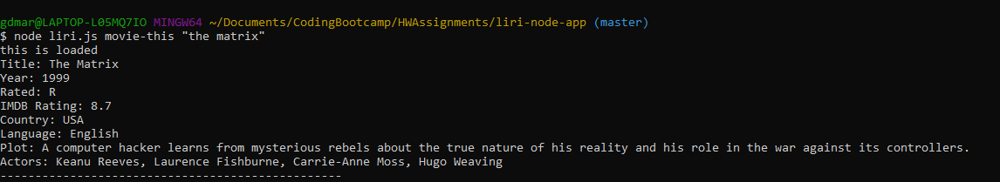
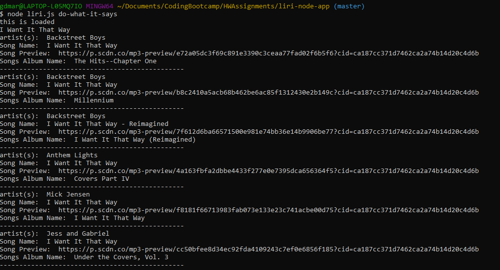

## liri-node-app
---
Overview

This assignment was completed as a student of the Vanderbilt University Coding Bootcamp. 

In this assignment, you will make LIRI. LIRI is like iPhone's SIRI. However, while SIRI is a Speech Interpretation and Recognition Interface, LIRI is a Language Interpretation and Recognition Interface. LIRI will be a command line node app that takes in parameters and gives you back data.

liri.js can take in one of the following commands:

concert-this
spotify-this-song
movie-this
do-what-it-says

node liri.js concert-this <artist/band name here>

This will search the Bands in Town Artist Events API ("https://rest.bandsintown.com/artists/" + artist + "/events?app_id=codingbootcamp") for an artist and render the following information about each event to the terminal:
Name of the venue
Venue location
Date of the Event (use moment to format this as "MM/DD/YYYY")

--------------------------------------
node liri.js spotify-this-song '<song name here>'

This will show the following information about the song in your terminal/bash window

Artist(s)
The song's name
A preview link of the song from Spotify
The album that the song is from

--------------------------------------
node liri.js movie-this '<movie name here>'

This will output the following information to your terminal/bash window:

   * Title of the movie.
   * Year the movie came out.
   * IMDB Rating of the movie.
   * Rotten Tomatoes Rating of the movie.
   * Country where the movie was produced.
   * Language of the movie.
   * Plot of the movie.
   * Actors in the movie.

If the user doesn't type a movie in, the program will output data for the movie 'Mr. Nobody

----------------------------------------
node liri.js do-what-it-says

Using the fs Node package, LIRI will take the text inside of random.txt and then use it to call one of LIRI's commands.

-----------------------------------------
1. Vanderbilt University Coding Bootcamp 
2. Contributor: demartin01
3. **Built with:** Node Js, Javascript 
4. **APIs:** OMDB, Spotify, Bandsintown 
